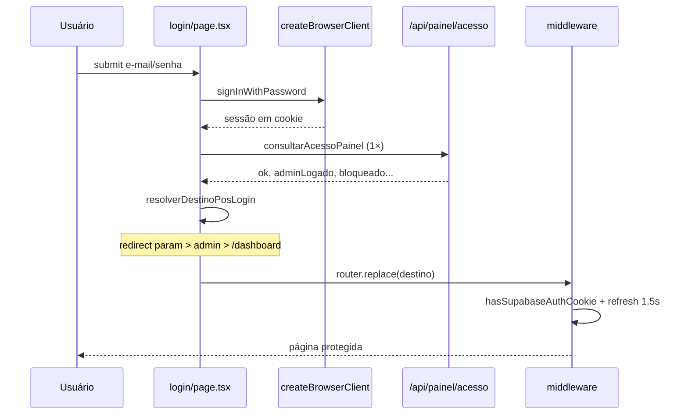

# Autenticação Connect — V1

Documento de referência para evitar regressões no fluxo de login (loop corrigido em mar/2026).

---

## Princípio central

**Browser e middleware devem compartilhar a mesma sessão via cookies SSR.**

| Camada | Cliente Supabase | Onde lê sessão |
|--------|------------------|----------------|
| Browser (login, painel) | `createBrowserClient` (`lib/supabase.ts`) | Cookies HTTP |
| Middleware (`middleware.ts`) | `createServerClient` (`lib/middleware-auth.ts`) | Cookies da request |
| APIs server | `getSupabaseAdmin` + Bearer token | Header `Authorization` |

**Nunca** voltar a usar `createClient` puro do `@supabase/supabase-js` no browser — grava só em `localStorage` e o middleware retorna **307 → /login** mesmo com usuário “logado”.

---

## Fluxo de login



### Passos (`app/(auth)/login/page.tsx`)

1. `signInWithPassword` via `lib/supabase.ts`
2. `getSession` — confirma `access_token`
3. **Uma** chamada a `consultarAcessoPainel` (`lib/connect-auth-client.ts`)
4. `resolverDestinoPosLogin`:
   - Se `?redirect=/caminho` (path relativo seguro) → usa redirect
   - Senão, se `adminLogado` → `/admin`
   - Senão → `/dashboard`
5. `router.replace(destino)`

### Já logado

No mount, se já existe sessão, repete passos 3–5 (evita ficar na tela de login).

### O que **não** fazer no login

- Chamar `/api/assinatura/status` para decidir destino (pesado + causava loop com painel/acesso)
- Retry em loop na mesma tela
- Ignorar `?redirect=` do middleware

---

## Fluxo de logout

### Painel (`PainelShell.tsx` → `handleLogout`)

1. Demo: `sairDemoMode()` + `limparSessaoReal()` → `/login`
2. Sessão real: `supabase.auth.signOut()` → limpa cookies SSR
3. `limparSessaoReal()` → flags locais demo/sessão
4. `router.push('/login')`

### Layout do painel (`app/(painel)/layout.tsx`)

`onAuthStateChange` com evento **`SIGNED_OUT`** → `router.replace('/login')`.

**Não** redirecionar para login quando `session === null` em outros eventos (`TOKEN_REFRESHED`, `INITIAL_SESSION`, etc.) — isso recriava o loop.

### Admin (`app/admin/page.tsx`)

Botão sair usa o mesmo `supabase.auth.signOut()` do browser client.

---

## Middleware

Arquivo: `middleware.ts` + `lib/middleware-auth.ts`

### Ordem de decisão

1. Redirect canônico de host (legado → www)
2. Rotas públicas (`isPublicPath`) → `next()`
3. Rotas não protegidas → `next()`
4. Cookie demo (`connect_demo_ativo=sim`) → `next()`
5. Sem cookie auth (`hasSupabaseAuthCookie`) → `/login?redirect={pathname}`
6. `refreshSessionWithTimeout` (1,5s):
   - timeout → `/manutencao`
   - inválido → `/login?redirect=...&motivo=sessao`
   - ok → `next()` com cookies atualizados

### Rotas protegidas

`/admin`, `/dashboard`, `/orcamentos`, … — ver `isProtectedPainelPath`.

### Rotas isentas (não passam por auth middleware)

`/login`, `/api/*`, `/view/*`, `/impressao-*`, assets estáticos, etc.

### Fail-fast

`MIDDLEWARE_AUTH_TIMEOUT_MS = 1500` — evita `MIDDLEWARE_INVOCATION_TIMEOUT` na Vercel.

---

## Cookies SSR e `createBrowserClient`

```ts
// lib/supabase.ts — ÚNICO client do browser
import { createBrowserClient } from '@supabase/ssr'
export const supabase = createBrowserClient(url, anonKey)
```

- `lib/supabase-browser.ts` reexporta `lib/supabase.ts` (mesma instância).
- Cookies seguem padrão Supabase: nome contém `-auth-token`.
- Middleware detecta com `hasSupabaseAuthCookie` **antes** de chamar rede.

---

## `/api/painel/acesso` — validação de entrada no painel

**Responsabilidade:** perfil, trial, bloqueio, flag `adminLogado`.

Chamado por:

- `app/(painel)/layout.tsx` (1× ao entrar)
- `lib/connect-auth-client.ts` (login + dedup)
- `PainelShell` (flag admin no menu — via mesmo helper)

### Resposta principal

```json
{
  "ok": true,
  "adminLogado": false,
  "bloqueado": false,
  "perfil": { ... },
  "avisoTrial": "...",
  "isTrial": true
}
```

### Admin

`isUsuarioAdmin` (perfil role) + `isUsuarioAdminServer` (ADMIN_EMAILS + role).

**Proibido:** chamar `/api/assinatura/status` de dentro desta rota (causava loop e timeout em cadeia).

### Timeout

Supabase anon com `fetchWithTimeout` 8s.

---

## `/api/assinatura/status` — snapshot de plano

**Responsabilidade:** dados de assinatura, trial, limites, `isAdminMaster` para UI de planos.

Chamado por:

- `hooks/useAssinatura.ts` (TrialBanner, página assinatura, planos)
- **Não** usar no login, layout, PainelShell nem painel/acesso

### Admin nesta rota

Retorna `isAdminMaster: true` quando `isUsuarioAdminServer({ email, perfil })`.

---

## Regras de admin

### Fonte de verdade (server)

`lib/access-server.ts`:

| Verificação | Onde |
|-------------|------|
| `ADMIN_EMAILS` ou `CONNECT_ADMIN_EMAILS` (env, vírgula) | `isAdminEmailServer` |
| Perfil: `role` ∈ admin/master/owner/… | `isPerfilRoleAdmin` |
| Combinação | `isUsuarioAdminServer` |

### Rotas admin API

`lib/api-auth.ts` → `requireAdminFromRequest`:

1. Bearer token válido
2. `isUsuarioAdminServer({ email })` ou perfil com role admin

### Client (browser)

`lib/access.ts` — **não** confia e-mail no client (`isAdminEmail` sempre `false`).

Use `consultarAcessoPainel().adminLogado` ou resposta de API com flag server.

### Destinos

| Usuário | Login sem redirect | Login com `?redirect=/admin` |
|---------|-------------------|------------------------------|
| Admin (ADMIN_EMAILS) | `/admin` | `/admin` |
| Cliente | `/dashboard` | path solicitado |

---

## Mapa de arquivos críticos

| Arquivo | Papel |
|---------|-------|
| `lib/supabase.ts` | Browser client (cookies) |
| `lib/middleware-auth.ts` | Helpers middleware + refresh timeout |
| `middleware.ts` | Gate de rotas protegidas |
| `lib/connect-auth-client.ts` | `consultarAcessoPainel` + dedup + destino pós-login |
| `app/(auth)/login/page.tsx` | Login e redirect |
| `app/(painel)/layout.tsx` | Validação acesso + anti-loop auth |
| `app/(painel)/components/painel/PainelShell.tsx` | Menu admin + logout |
| `app/api/painel/acesso/route.ts` | API de acesso |
| `app/api/assinatura/status/route.ts` | API de plano/assinatura |
| `lib/access-server.ts` | ADMIN_EMAILS |
| `lib/api-auth.ts` | Guard de rotas `/api/admin/*` |
| `app/admin/page.tsx` | Painel master (fora do layout painel) |

---

## Anti-padrões (causam loop de login)

1. `createClient` do supabase-js no browser em vez de `createBrowserClient`
2. `onAuthStateChange` redirecionando em qualquer `session === null`
3. `/api/painel/acesso` chamando `/api/assinatura/status`
4. Retry 5× em `PainelShell` para checar admin
5. `useEffect` com `[pathname]` refazendo validação de admin a cada navegação
6. Login chamando `status` + layout chamando `acesso` + shell chamando `status` de novo

---

## Variáveis de ambiente

```env
NEXT_PUBLIC_SUPABASE_URL=
NEXT_PUBLIC_SUPABASE_ANON_KEY=
SUPABASE_SERVICE_ROLE_KEY=
ADMIN_EMAILS=admin@exemplo.com,outro@exemplo.com
# ou CONNECT_ADMIN_EMAILS=
```

---

## Checklist antes de merge (auth)

- [ ] `lib/supabase.ts` usa `createBrowserClient`
- [ ] Login usa só `consultarAcessoPainel`, não `assinatura/status`
- [ ] `painel/acesso` não chama `assinatura/status`
- [ ] Layout só redireciona login em `SIGNED_OUT`
- [ ] PainelShell: no máximo 1× `consultarAcessoPainel` no mount
- [ ] Login respeita `?redirect=`
- [ ] Teste manual: login admin → `/admin`, F5, logout, login cliente → `/dashboard`

---

## Logs de diagnóstico (temporários)

| Log | Origem |
|-----|--------|
| `[LOGIN_SUBMIT]` / `[LOGIN_SUCCESS]` / `[LOGIN_REDIRECT]` | login/page |
| `[PAINEL_READY]` / `[PAINEL_REDIRECT]` | (painel)/layout |
| `[ADMIN_PAGE_START]` | admin/page |
| `[STATUS_START]` / `[STATUS_END]` | assinatura/status |

Remover ou reduzir após estabilização em produção.
